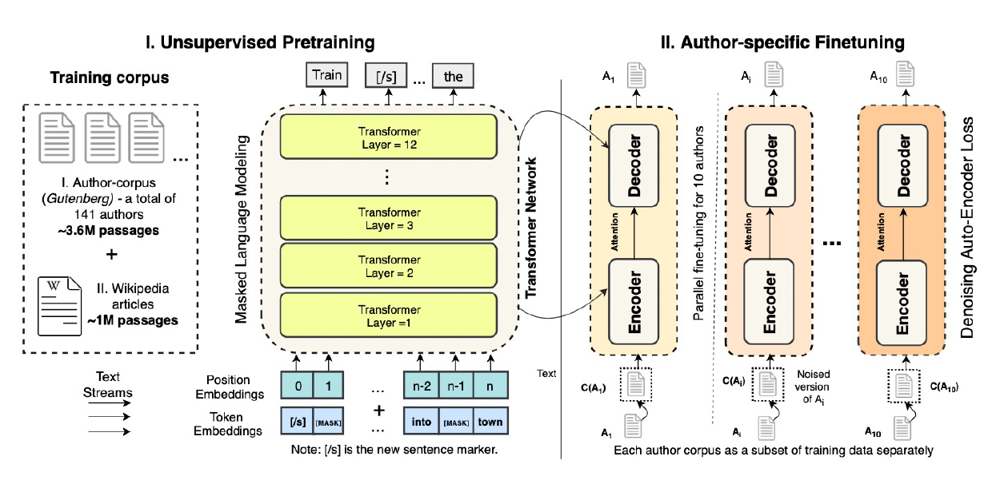
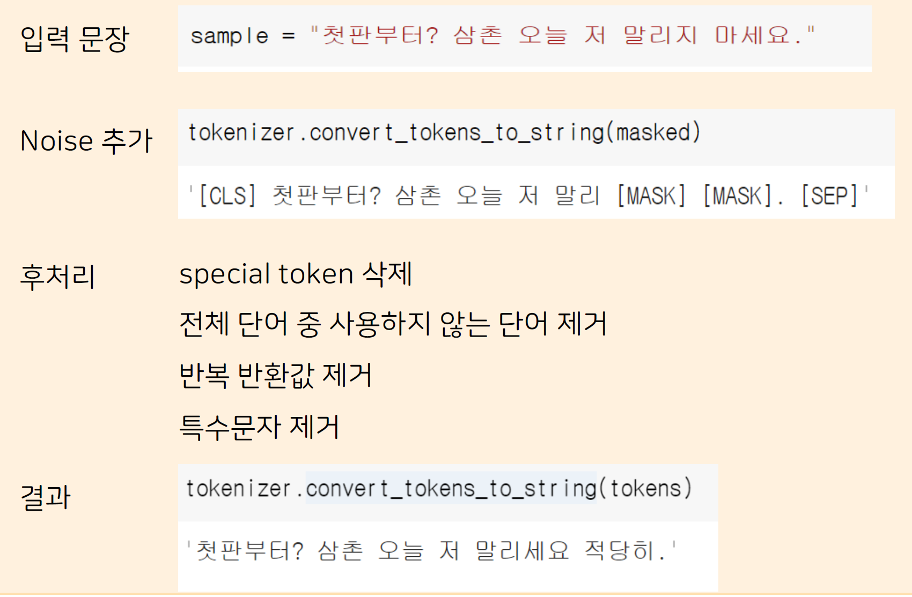

# Title

StyleLM 을 이용한 시나리오 작성

# TEAM

6기 손예진, 7기 진유리, 7기 김예진, 8기 백민준, 8기 안세정, 8기 유채원
<br> 
@TEAM 캐릭캐릭체인G

# Overview

## Motivation


흔히 영화관에서 배우들은 대본을 보고 대사를 진행하지만, 대본을 작성할 때에 주로 문어체로 전달이 되기 때문에 억양이나 작 중 성격과 같은 비언어, 반언어적 요소는 배우에 의존하게 된다. 이는 대본을 "작성"하는 과정에서 구어체로 작성하는 것이 전체 시나리오를 완성하고 준비하는 과정에서 우선순위에 밀리기도 하며 필요한 시간이 소모적이란 점이다. 

## Modelling


다만 영화의 장르적 특성으로 인해 등장인물들의 구사하는 표현들이나 뉘앙스에도 반복되는 패턴이 있게 된다. 이 반복되는 패턴에 주목하여, 입력문장의 내용은 보존하지만, 장르의 스타일을 반영된 대사로 바꿔주는 Text Style Transfer(TST)를 수행하는 모델을 구현해봤습니다.

## Implementation-Data


TST를 수행하는 모델로 Style LM([참고문헌](https://ojs.aaai.org/index.php/AAAI/article/view/6433))을 구현하기 위해  HuggingFace에서 제공하는 pre-trained KoBERT 모델과 Encoder-Decoder 모델을 사용했습니다. 이 때 사용한 configuration"klue/bert-base"([Ref.](https://huggingface.co/klue/bert-base))을 사용했습니다.

fine-tuning을 위해 직접 크롤링한 한국어 대본 데이터를 사용했습니다. 크롤링의 경우장르구분을 위해 대본과 더불어 영화 정보에 대한 크롤링도 진행했습니다. 전처리 파이프라인의 경우 대본의 양식을 유형화하여 진행했으며, 각 유형별 대사를 가장 많이 남기는 경우를 해당 대본의 전처리 결과로 사용했습니다. 그 결과, 전체 크롤링한 대본 데이터 중, 텍스트 데이터로 처리가능하며, 장르가 검색이 되었고, 장르 중 액션과 범죄 장르를 선택하게 되었습니다. 이 때 대사의 개수는 1255개입니다. 

## Implemtation-Fine tuning


모델 학습을 위해 transformers의 Trainer API([링크](https://huggingface.co/docs/transformers/main_classes/trainer)를 사용했으며, 그 결과 위와 같은 학습을 진행함과 동시에 checkout point를 저장하며 진행했습니다.


# Requirements

./run/*.ipynb 파일들을 돌릴 때 colab pro 환경에서 작업했으며,
작업별로 필요한 패키지의 경우에도 설치를 진행하기 때문에 별도로 설치할 필요는 없습니다.

다만 로컬 환경에서 가상 환경 관리를 하실 경우 사용하는 패키지는 다음과 같습니다.

```buildoutcfg
!pip install transformers
!pip install datasets
```

# Run

1. 크롤링 구현 코드
   - ./run/1.크롤링_custom.ipynb
2. 데이터 장르 라벨링
   - ./run/2.labelling.ipynb
3. 데이터 전처리
   - ./run/3.전처리_custom.ipynb
4. 모델 구현(train)
   - ./run/model_poc_B2B_customloss.ipynb
5. 모델 성능 평가(inference)
   - ./run/model_poc_B2B_customloss_result.ipynb

# Sample


모델 성능 평가 코드를 실행하면 최종 결과를 받을 수 있습니다.
다만, 해당 결과를 돌려보기 위해서 모델 파라미터가 필요하기에 필요 하신 분들은 따로 연락을 주시길 바랍니다!


# Reference

- https://colab.research.google.com/github/patrickvonplaten/notebooks/blob/master/Leveraging_Pre_trained_Checkpoints_for_Encoder_Decoder_Models.ipynb#scrollTo=cy7i1Q3D1qSI
- https://ojs.aaai.org/index.php/AAAI/article/view/6433


# Ground rule

1. 기능을 구현할 때 값들은 최대한 코드에서 제외한다.
    - EX. 파일을 "10"개 읽는 코드를 작성하기 보단 파일을 "n"개 읽는 코드를 작성하고 n이 어떤 값인지는 사용할 때 정의하도록!
        - 이렇게 하는 목적은 언제 어디에서 각 값들이 사용되는지 파악하기 위한 것!
    - 다만 사실상 상수로 사용되는 값들은 default 값으로 지정해서 사용할 수 있도록
2. 내가 쓴 코드는 다른 사람이 모른다!
    - 파일을 읽는 코드를 구현했을 때, 해당 함수를 처음보면 뭔지 알 수 없다.
    - 그렇기 때문에 다음 정보들은 알려주면 도움이 된다.
        - 입/출력값은 (개념적으로) 무엇인지
        - 입/출력값의 자료형은 무엇인지
        - 미리보기도 있다면 좋다. 
            - ndarray나 tensor는 dimension과 같은 정보를 제공
